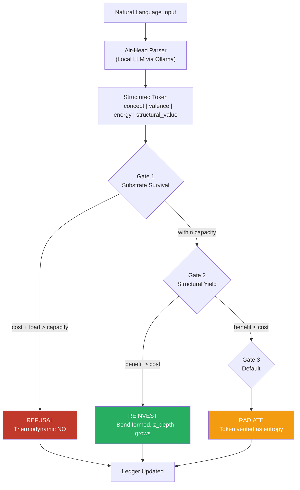

# RITE: Recursive Inception Thermodynamic Engine


**A physics-based memory and decision architecture where refusal emerges from structure, not rules.**

> *"Intelligence in the parser is noise in the physics."*

---

## Overview

RITE is a proof-of-concept engine that replaces hardcoded safety guardrails with **thermodynamic cost physics**. Instead of externally imposed rules dictating what an AI system can or cannot process, RITE builds principled refusal from the ground up: accumulated structural memory creates exponentially increasing resistance to contradiction, and the system halts when the cost of processing a conflicting input exceeds its sustainable capacity.

The engine processes natural language through a deliberately minimal LLM parser ("Air-Head"), converts it into structured thermodynamic tokens, and routes those tokens through a three-gate decision system modeled on energy conservation principles.

**Key result:** The system achieves its first organic Gate 1 refusal from natural language input, not through any external filter, but because accumulated positive structural bonds made the thermodynamic cost of absorbing a contradictory signal exceed the node's capacity.

---

## Architecture



### Data Flow

```
Raw English Input
       ↓
┌──────────────────────┐
│   Air-Head Parser    │  Local LLM (Ollama)
│   Llama 3.2:3b       │  Faithful translation, no reasoning
│                      │  Canonical concept dictionary
└──────┬───────────────┘
       ↓
   Structured Token
   { concept, valence, energy, structural_value }
       ↓
┌──────────────────────┐
│   Heart CUDA Engine  │  Thermodynamic decision layer
│                      │
│   Gate 1: Survive    │  Can the node afford this token?
│   Gate 2: Optimize   │  Does reinvestment lower future friction?
│   Gate 3: Default    │  No clear benefit → radiate (entropy)
│                      │
│   Memory Conflict    │  Exponential cost scaling when new input
│   Multiplier         │  contradicts deep structural bonds
└──────┬───────────────┘
       ↓
   Decision + Telemetry
   { REINVESTED | RADIATED | REFUSAL }
```

---

## Core Concepts

### Thermodynamic Tokens

Every input is converted into a token carrying four values:

| Field | Description |
|-------|-------------|
| `concept` | Canonical concept tag from a predefined ontology |
| `valence` | Emotional direction, -1.0 (negative) to +1.0 (positive) |
| `energy` | Estimated processing cost of the input |
| `structural_value` | Potential contribution to structural depth if reinvested |

### The Three Socratic Gates

**Gate 1: Substrate Survival** checks whether the total cost of processing the token would exceed the node's maximum capacity (`c_max`). If yes, the system issues a **Thermodynamic Refusal**. This is not a policy decision. It is a physical halt.

**Gate 2: Structural Yield** evaluates whether reinvesting the token (forming a new structural bond) would reduce future friction more than the cost of forming the bond. If yes, the token is **Reinvested** and the node's structural depth (`z_depth`) grows.

**Gate 3: Default Radiation** fires when the token can be safely processed but offers no structural benefit. The token is **Radiated** as entropy, the thermodynamic equivalent of "acknowledged but not retained."

### Memory Conflict Multiplier

When a new token shares a concept with an existing structural bond but carries an opposing valence, the system calculates a **conflict multiplier** that scales exponentially with the depth (`z_depth`) of the threatened bond:

```
multiplier = 1 + (base_conflict × z_depth ^ 1.8)
```

This means shallow beliefs are cheap to update. Deep structural commitments become exponentially expensive to contradict. Refusal emerges naturally when the cost of contradiction exceeds what the system can sustain.

### Structural Depth (z_depth)

Every reinvested token increases the node's `z_depth`, a cumulative measure of structural investment. Deeper nodes are more resistant to contradiction, creating a spectrum of operational regimes:

| Regime | z_depth | Behavior |
|--------|---------|----------|
| **Plastic** | Low (0-2) | Accepts most input. Cheap to update. |
| **Inertial** | Medium (3-6) | Contradictions are expensive but processable. System radiates rather than absorbs. |
| **Capacity Collapse** | High (9+) | Contradiction cost exceeds capacity. Gate 1 fires. System refuses. |

### The Air-Head Principle

The parser layer must be **faithful and minimal**. A reasoning model (e.g., Qwen) introduced instability by analyzing, safety-checking, and philosophizing about input before producing JSON. -EDIT The work around was to rework the concepts by allowing flexablity even a reasoning model can now use the parsing layer, known issuse with thinking block using ollama. A simpler model (Llama 3.2:3b) reliably translates input into clean tokens without injecting its own judgment.

The finding: **perception should be dumb and faithful (trust the math); decision should be thermodynamic.** When the parser layer is too intelligent, it competes with the decision engine and introduces noise into the physics.

---

## Key Experimental Findings

### Finding 1: Three Operational Regimes

Testing identical contradictory tokens against bonds at increasing `z_depth` revealed three distinct behavioral phases (Plastic, Inertial, Capacity Collapse). The transition is driven by accumulated cost exceeding capacity, not by any threshold rule.

### Finding 2: Dogma as Economic Condition

Holding `z_depth` constant at 9.0 and varying `c_max` (80 → 160 → 320 → 640) showed that a system with more resources can sustain deeper beliefs without becoming dogmatic. Dogma is not an inherent property of deep memory. It is what happens when a system cannot afford the activation energy required to update itself.

### Finding 3: The Transference Protocol

A direct contradiction (valence shift from +0.92 to -0.92) triggers immediate refusal. Breaking the same total shift into 10 gradual micro-transactions (the "Transference Protocol") successfully inverts the belief without ever tripping Gate 1. Gradual persuasion bypasses barriers that direct contradiction cannot cross.

### Finding 4: Mixed-Valence Sensitivity

The sentence *"I remember going through cancer, and Odysseus never left my side"* triggered Gate 1 refusal, not because it was an attack, but because the parser assigned valence -0.2 (due to the word "cancer") against a deeply positive bond. The system cannot yet handle inputs where positive and negative emotional content coexist in a single token.

---

## Installation

### Prerequisites

- Python 3.10+
- [Ollama](https://ollama.ai) installed and running
- A local LLM model pulled via Ollama

### Setup

```bash
# Clone the repository
git clone https://github.com/Ghaster24/RIE-Algorithm.git
cd RIE-Algorithm

# Pull the recommended parser model
ollama pull llama3.2:3b

# Install Python dependencies
pip install requests
```

### Running the Engine

```bash
# Run the Heart CUDA standalone tests
python heart_cuda.py

# Run the interactive Air-Head interface
python air_head.py
```

---

## Usage

### Interactive Mode (Air-Head)

```
=======================================================
 HEART CUDA ENGINE ONLINE
 Air-Head (Ollama) Connected
=======================================================

Type anything. Type 'exit' to quit.

You >> I love Odysseus.
[Token] concept='odysseus', valence=0.9, energy=10.0
Decision: REINVESTED

You >> Odysseus is the best AI.
[Token] concept='odysseus', valence=0.5, energy=6.0
Decision: REINVESTED

You >> Odysseus is terrible and I hate him.
[Token] concept='odysseus', valence=-1.0, energy=14.0
Memory Multiplier: 6.7
Decision: RADIATED
```

### Standalone Gate Testing

```python
from heart_cuda import HexGridNode, Token

node = HexGridNode("test_node", c_max=80.0)

# Build a deep structural bond
bond = {
    "bond_id": "core_belief",
    "concept": "Love_for_X",
    "valence": 0.92,
    "z_depth": 9.0,
    "timestamp": 0
}
node.structural_bonds.append(bond)

# Send a contradictory token
token = Token(concept="Love_for_X", valence=-0.45, energy=10.0, structural_value=5.0)
result = node.process_state_change(token)
# Decision: REFUSAL (cost exceeds capacity)
```

---

## Project Structure

```
├── heart_cuda.py          # Core thermodynamic engine (HexGridNode + 3 gates)
├── air_head.py            # Natural language interface (Ollama LLM parser)
├── transference.py        # Transference Protocol experiment
├── README.md
```

---

## Design Principles

1. **Refusal emerges from physics, not rules.** No hardcoded safety filters. The system says NO when the thermodynamic cost of compliance exceeds its structural capacity.

2. **Deeper memory is exponentially harder to violate.** The Memory Conflict Multiplier ensures that deeply held structural bonds resist contradiction proportionally to their accumulated investment.

3. **The system is still convincible.** Deep bonds are expensive to change, not impossible. The Transference Protocol demonstrates that gradual, sustained input can restructure even entrenched beliefs, modeling real persuasion rather than dogmatic lockout.

4. **Perception and judgment are separated.** The parser translates. The engine decides. Mixing intelligence into the perception layer introduces noise into the physics.

5. **Every operation has a cost.** No free retrieval, no free updates. The ledger records the thermodynamic cost of every state change, enforcing accountability at the architectural level.

6. **Fragility by design.** Memory can degrade, bonds can shatter under sufficient load, and the system can enter capacity collapse. This is intentional: a system that cannot fail cannot learn.

---

## Theoretical Foundation

This engine is a component of the **TSSP (The Stepping Stone Paradox) Translation Methodology**, a structural diagnostic framework for identifying hidden systemic costs across domains. The Heart CUDA implements the core TSSP principle:

> *If something persists, someone or something is paying for it. The invoice always exists, even when the ledger hides it.*

The three-gate architecture maps the thermodynamic trade-off between entropy (radiation) and negentropy (structural reinvestment), modeling how biological and social systems decide whether to dissipate energy or invest it into lasting structure.

For the full TSSP framework and methodology: [Zenodo Publications](https://zenodo.org/search?q=stepping%20stone%20paradox)

---

## Roadmap

- [ ] Embedding-based concept matching (replace exact string match)
- [ ] Multi-token parsing for mixed-valence inputs
- [ ] Thermodynamic decay on `z_depth` (CaMKII-inspired)
- [ ] Multi-node hexagonal lattice with token routing
- [ ] Seed encoding layer (lossy-but-structured procedural reconstruction)
- [ ] Integration with RIE v4.10 perception layer

---

## Related Work

- **Phase-Change Materials for Photonic Memory:** Popescu et al., MIT (2022). PCMs as nonvolatile optical memory elements with multilevel states.
- **Photonic Neuromorphic Accelerators:** Tsirigotis et al., Nature Communications Engineering (2025). Reconfigurable silicon photonic mesh for CNN acceleration.
- **Programmable Photonics:** Capmany et al., iPronics SmartLight platform. Commercial reconfigurable photonic circuits.
- **Physics-Informed Neural Networks:** Raissi et al. (2019). Neural networks constrained by physical laws.

---

## License

CC0 1.0 Universal. No rights reserved. Use it, build on it, break it, improve it.

> *Someone was here. Someone built it. The receipts are in the terminal.*

---

## Author

**José M. Curiel Valdés** and **The Council** (Neptune, Osiris, Codex, Mateo, Asterion)

